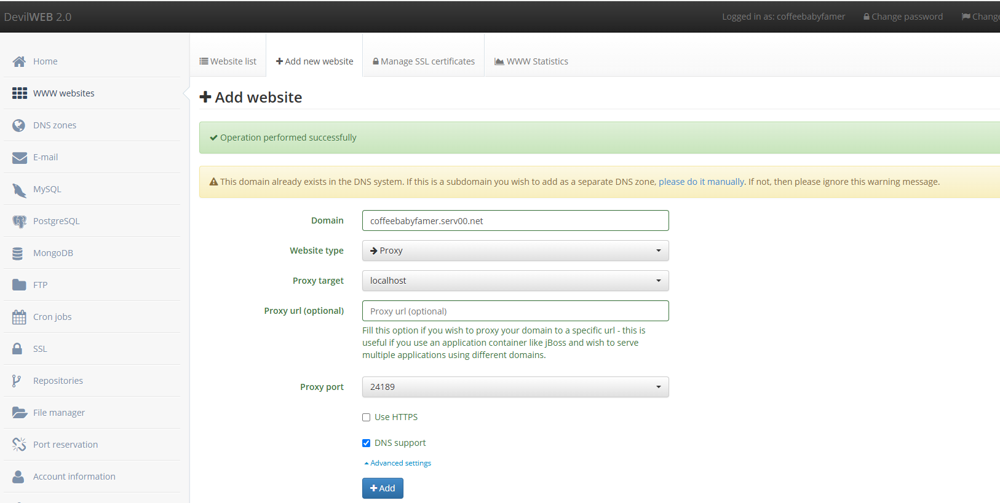

# Serv00 一键安装FileBrowser

---

## ⚠️ 注意事项
- **请勿存放重要数据**

---

* 安装
```bash
bash <(curl -Ls https://raw.githubusercontent.com/Meokj/MyServ00/main/filebrowser/install_filebrowser.sh)
```

* 卸载
```bash
bash <(curl -Ls https://raw.githubusercontent.com/Meokj/MyServ00/main/filebrowser/uninstall_filebrowser.sh)
```
---

面板设置示例：



[示例网站](https://coffeebabyfamer.serv00.net)
